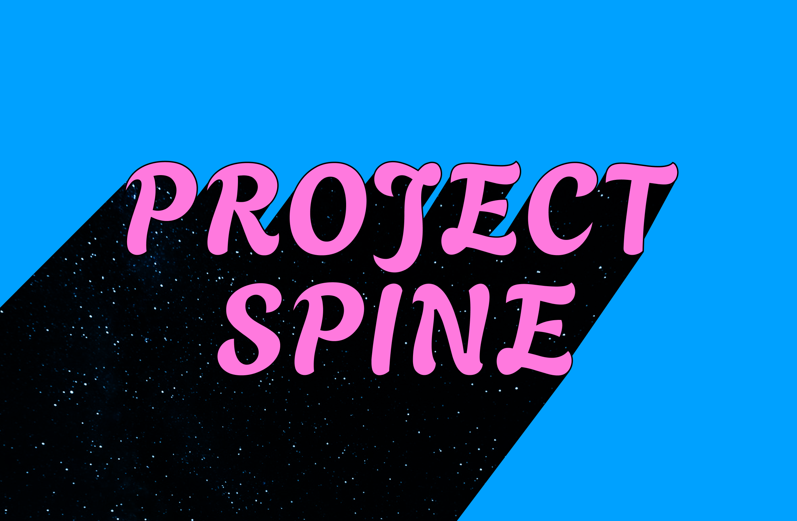

<p align="center">
  
</p>

<p align="center"><em>the missing context layer for software delivery</em></p>

# Project Spine

[](https://github.com/PetriLahdelma/project-spine/actions/workflows/ci.yml)
[](./LICENSE)
[](./package.json)
[](./tsconfig.json)
[](./PRD.md)
[](./CONTRIBUTING.md)

**A context compiler for software projects.**

Project Spine turns a client brief, a repo, and optional design-system inputs into a machine-readable project operating layer: agent instructions, architecture summary, UX rules, scaffold decisions, QA guardrails, and a sprint-ready backlog — all in one pass, all in your repo.

```
brief.md ──┐
repo/   ───┼──▶  spine.json ──▶  AGENTS.md + CLAUDE.md + copilot-instructions.md
design.md ─┘                    scaffold-plan.md, qa-guardrails.md, sprint-1-backlog.md,
                                component-plan.md, route-inventory.md, rationale.md
```

> **Status — v0.1 (pre-alpha).** The CLI works end-to-end: brief + repo + optional design + optional template → canonical `spine.json` + generated exports. Published here so the thinking and implementation are public from day one.

See the full product thinking in [PRD.md](./PRD.md), the research evidence in [docs/research-citations.md](./docs/research-citations.md), and the "why not just Claude?" moat analysis in [docs/positioning.md](./docs/positioning.md).

---

## Why

Developers save ~10 hours a week with AI tools and lose the same ~10 hours to fragmented context (Atlassian 2025 DevEx). Only ~5% of repositories contain AI configuration files ([arXiv, Oct 2025](https://arxiv.org/html/2510.21413v1)), and the ones that do tend to drift immediately. Practitioners consistently warn against auto-generated `AGENTS.md` / `CLAUDE.md` boilerplate — [Addy Osmani, March 2026](https://medium.com/@addyosmani/stop-using-init-for-agents-md-3086a333f380).

The gap isn't more AI. It's a repo-native, drift-aware compiler that turns actual project intent (brief, code, design rules) into rules agents and humans can both trust. That's what Project Spine is.

---

## Install

```bash
# from npm (alpha — @latest and @next both point here until we ship stable)
npm install -g project-spine@next

# today: from source
git clone https://github.com/PetriLahdelma/project-spine.git
cd project-spine
npm install
npm run build
node dist/cli.js --help
```

Requires Node ≥ 20.

---

## Quickstart

```bash
# 1. scaffold a brief from a preset
spine init --template saas-marketing

# 2. compile brief + repo (+ optional template + optional tokens) into spine.json and exports
spine compile --brief ./brief.md --repo . --template saas-marketing
# or with a Figma / Tokens Studio JSON export:
spine compile --brief ./brief.md --repo . --tokens ./tokens.json

# 3. regenerate a subset without recompiling
spine export --targets claude,copilot

# 4. analyze any existing repo without a brief
spine inspect --repo .

# 5. check drift between last compile and current state (CI-friendly)
spine drift check --fail-on any

# 6. browse templates
spine template list
spine template show design-system
```

---

## What you get

A single `spine compile` run writes **18 files**:

```
./AGENTS.md                                  (agents.md convention — tool-discovery location)
./CLAUDE.md                                  (Claude Code — uses @import to keep lean)
./.github/copilot-instructions.md            (Copilot — self-contained)

./.project-spine/
  spine.json                                 canonical machine-readable model (hashed)
  brief.normalized.json                      parsed brief
  repo-profile.json                          detected stack + conventions
  warnings.json                              ambiguities, conflicts, missing fields
  exports/
    AGENTS.md, CLAUDE.md, copilot-instructions.md
    architecture-summary.md                  detected stack at a glance
    brief-summary.md                         normalized brief at a glance
    scaffold-plan.md                         routes, components, sprint-1 seed
    route-inventory.md                       route list with rationale
    component-plan.md                        component buckets + usage rules
    qa-guardrails.md                         actionable QA checklist + DoD
    sprint-1-backlog.md                      sprint 1 backlog with acceptance criteria
    rationale.md                             client-facing project rationale
```

See [docs/sample-output/](./docs/sample-output/) for a real compiled example.

---

## Principles

1. **Repo-native first.** Outputs live in files you can version, diff, and trust.
2. **Useful without AI.** A human reviewer should want to keep the files.
3. **Opinionated, not magical.** Good defaults, transparent reasoning, no black box.
4. **Fast path to value.** First run under 30 seconds on a typical repo.
5. **Drift-aware.** `spine drift check` flags input drift, hand-edited exports, and missing files. Generation is cheap; staying aligned is the moat.
6. **Deterministic before enriched.** LLM calls (when they arrive) never load-bear.
7. **Security by default.** No implicit network calls, no uninvited uploads.

---

## How it works

```
┌────────────┐   ┌────────────┐   ┌──────────────┐   ┌──────────────┐
│ brief.md   │──▶│  Brief     │──▶│   Rules      │──▶│  Exporters   │
└────────────┘   │  parser    │   │  compiler    │   │  (MD + JSON) │
┌────────────┐   └────────────┘   │  (merge,     │   └──────────────┘
│ repo/      │──▶┌────────────┐──▶│  dedupe,     │
└────────────┘   │ Repo       │   │  conflict    │
┌────────────┐   │ analyzer   │   │  detection)  │
│ design.md  │──▶└────────────┘──▶│              │
└────────────┘                    └──────────────┘
                                         │
                                         ▼
                                  ┌───────────────┐
                                  │ spine.json    │
                                  │ warnings.json │
                                  └───────────────┘
```

Every rule in `spine.json` carries a `source` pointer — `brief.md#section0/item3`, `repo-profile#framework`, `template:saas-marketing/contributes#2`, or `inferred:...` — so reviewers can audit _why_ a rule exists, not just trust that it does.

---

## Templates

Four starter presets ship in the box:

| Template         | Project type            | Contributes                                                                  |
| ---------------- | ----------------------- | ---------------------------------------------------------------------------- |
| `saas-marketing` | Marketing site          | 7 routes, 7 components, LCP/CLS budgets, privacy guardrails                  |
| `app-dashboard`  | Authenticated dashboard | role-gated routes, `PermissionGate`/`DataTable`/`AppShell`, PII scrubbing    |
| `design-system`  | Library                 | zero routes, tokens/primitives/Storybook QA, ships its own `design-rules.md` |
| `docs-portal`    | Documentation site      | docs-specific routes, `TOC`/`CodeBlock`/`SearchBar`, broken-link QA          |

Each template contributes routes, components, QA, UX, a11y, and agent rules — not just a brief scaffold. Every contributed rule is tagged `kind: "template"` in `spine.json` for traceability.

---

## Agent skills (for Claude Code, Codex CLI, Cursor)

The [`skills/`](./skills/) directory ships six agent skills that teach your coding agent how to operate Project Spine end-to-end — kickoff, drift, templates, rationales, workspaces, plus an orientation skill that triggers on phrases like "new client project" or "AGENTS.md is stale".

```bash
# install into ~/.claude/skills (Claude Code)
./skills/install.sh

# also install into ~/.codex/skills (Codex CLI)
./skills/install.sh --codex

# preview without touching disk
./skills/install.sh --dry-run
```

Each skill is a single `SKILL.md` with YAML frontmatter describing its trigger phrases. The installer symlinks them so edits land immediately. See [skills/README.md](./skills/README.md) for what each skill does and how they chain.

---

## Roadmap

- **v0.1** (here) — brief parser, repo inspector, deterministic exporters, 4 templates, CLI
- **v0.2** — richer design-rules input, team templates (save/apply), better warnings
- **v0.3** — `spine drift check` with CI-friendly exit codes, GitHub Action, first paid tier
- **v0.4** — hosted workspace, Jira/Linear export, shareable project packs

See [PRD.md §16](./PRD.md#16-roadmap) for detail.

---

## Development

```bash
npm install
npm run typecheck    # tsc --noEmit
npm test             # vitest run (35 tests)
npm run build        # tsc → dist/
```

Project layout:

```
src/
  analyzer/      stack + convention detection (§7.2 of the PRD)
  brief/         Markdown + frontmatter brief parser (§7.1)
  compiler/      the rules compiler, hash, deterministic ID (§7.3)
  design/        optional design-rules parser
  exporters/     one file per output target (§7.4 / §7.5)
  model/         zod schemas for every artifact
  reporters/     Markdown summaries
  templates/     registry + manifest loader (§11)
  commands/      citty subcommands (init, compile, inspect, export, template)
templates/       bundled starter presets (§11)
examples/        sample briefs for tests and demos
docs/
  research-citations.md
  sample-output/ a real compiled example
PRD.md
```

---

## Contributing

See [CONTRIBUTING.md](./CONTRIBUTING.md). This is a single-maintainer project right now; issues and sharp feedback are welcome. PRs get a warmer reception after an issue discussion.

## Security

See [SECURITY.md](./SECURITY.md) for how to report vulnerabilities.

## License

MIT. See [LICENSE](./LICENSE).
