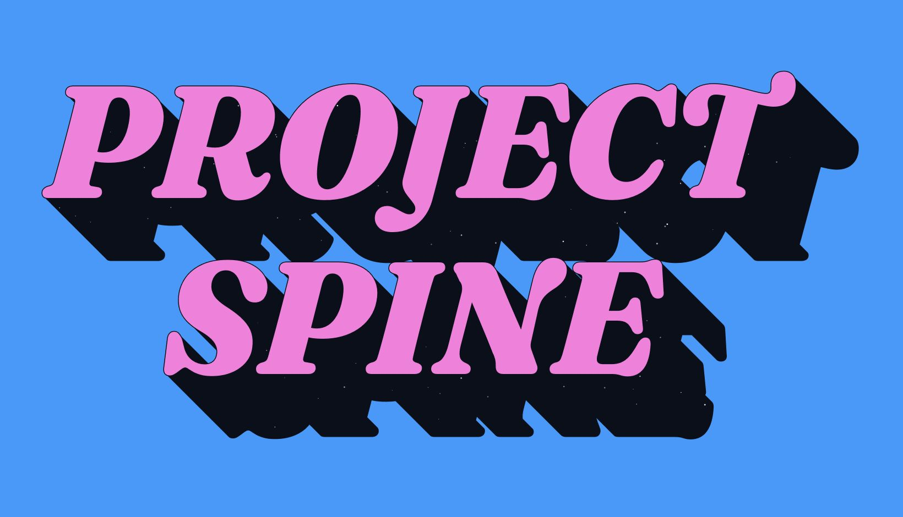

# Project Spine

**Keep the correction. Prove the check.**

[](https://github.com/PetriLahdelma/project-spine/actions/workflows/ci.yml)
[](LICENSE)

Your team already learned why that change broke. Keep the lesson beside the code,
prove it catches the original failure, and give the next agent the relevant rule.

```text
reviewed correction → candidate rule → broken/fixed replay → verified guardrail
                                                                  ↓
                                               CI checks + scoped agent context
```

Project Spine is a local TypeScript CLI, library, GitHub Action and MCP server.
It keeps the source of each rule and checks its historical evidence before use.
The existing context compiler, design-token support and drift checks remain available.

## Keep the correction, not just the comment

The executable-check pilot adds `spine correction`: capture a reviewer-approved
Node built-in test from the fixed commit, prove that the same test fails on the
broken code and passes on the correction, then check later changes in restricted
Docker containers. No automatic test generation or model calls are involved.

Read the [correction quickstart](docs/corrections.md) for the synthetic behavioral
demo, explicit execution consent and the deliberately narrow dependency-free
JavaScript scope. The literal workflow below remains Docker-free and does not
execute repository code. [Bring a real correction](https://github.com/PetriLahdelma/project-spine/issues/new?template=learning_case.md)
to help evaluate the pilot; external adoption and improved agent outcomes have
not yet been established.

## See the complete loop

Run the verified GitHub Release beta artifact with Node 22.12+ (or Node 24) and
Git. The command, version, literal demo and correction demo were checked against
the downloaded asset digest. The install uses the network; the literal demo itself
needs no account, model key or Docker. npm registry publication is a separate
release step and is not claimed here.

```sh
npx --yes --package=https://github.com/PetriLahdelma/project-spine/releases/download/v0.10.0-beta.3/project-spine-0.10.0-beta.3.tgz spine demo
```

[GitHub Release asset](https://github.com/PetriLahdelma/project-spine/releases/download/v0.10.0-beta.3/project-spine-0.10.0-beta.3.tgz) · SHA-256 `ff0d733988e87cd0ee75029eea4599fd214c171896a3a40862d89b87928770a1`

The offline demo creates real Git commits in a new fixture repository. It records a
candidate rule, proves that the broken revision fails and the correction passes,
then reintroduces the defect and catches it. The report includes file-level evidence.
No account, model key or network connection is needed after installation.

This is a labeled synthetic fixture, not an AI benchmark or a customer incident.
Historical replay checks literal rules; it does not rerun an agent. The optional
[evaluation adapter](docs/evaluation.md) runs configured agents in separate local
clones and reports measured outcomes with and without guidance.

Contributors can build the maintained source instead:

```sh
git clone --branch main https://github.com/PetriLahdelma/project-spine.git
cd project-spine
npm ci
npm run build
node dist/cli.js demo
```

## Learn from your own correction

After building, replace `spine` below with `node /absolute/path/to/dist/cli.js`,
or run `npm link` from the checkout to install the command locally.

```sh
spine learn --case failure.json       # reviewed candidate, inactive
spine replay tenant-query            # broken fails; correction passes
spine guard                          # check the working tree
spine context --files src/invoices.js # relevant verified guidance
spine report --format html --out guard-report.html
```

Create a [failure case](docs/learning.md#record-a-real-failure) with explicit broken
and corrected revisions and scoped `require-text` or `forbid-text` rules. Cases
are immutable by id. Only replayed rules become active. Missing file coverage,
edited evidence, or deletion of the original failing file cannot produce proof.

```sh
# Retrieve PR evidence using your authenticated GitHub CLI; no external writes.
spine learn --from-pr https://github.com/OWNER/REPO/pull/123 --json

# Inspect sources and resolved historical evidence.
spine report --case tenant-query

# Gate changes using an explicit base revision.
spine guard --diff HEAD~1 --json
```

Literal checks are intentionally narrow. They do not understand control flow or
prove security. For example, a comment may satisfy a required literal. Combine
Spine with your tests and static analysis. We make no claim that a repository
becomes immune to future failures.

## Put the lesson where work happens

| Surface | What it does |
| --- | --- |
| CLI and library | Learn, verify, enforce and inspect local evidence |
| GitHub Action | Check committed rules and fail on violations or missing proof |
| MCP | Retrieve verified context for the files an agent is editing |
| HTML and JSON reports | Share inspectable findings and original provenance |
| Optional evaluation adapter | Compare configured agent outcomes in separate clones |
| Existing compiler | Generate portable project instructions from a brief and tokens |

The [GitHub Action](action.yml) builds the same pinned source you review. It uses
read-only repository permissions; fetch history and commit the learning ledger.
[CI setup and exit codes](docs/learning.md#ci).

For agents, configure `npx --yes --package=https://github.com/PetriLahdelma/project-spine/releases/download/v0.10.0-beta.3/project-spine-0.10.0-beta.3.tgz spine-mcp`; no persistent global install is required. Use `spine_context` before edits and `spine_guard` afterward. All integrations use the same local evidence. [MCP setup](docs/mcp.md).

## Still a context compiler

```sh
spine init --template saas-marketing
spine compile --brief brief.md --repo .
spine inspect --repo . --agent-files
spine drift check --fail-on any
spine drift diff
spine doctor
```

The compiler still emits `spine.json`, `AGENTS.md`, `CLAUDE.md`, Copilot and Cursor
instructions, source pointers, design rules and an export manifest. Existing
workflows do not need migration. [Compiled examples](docs/sample-output/).

## Develop and verify

```sh
npm ci
npm run typecheck
npm test
npm run build
npm run pack:check
npm run release:readiness
npm run stable:check
```

The stable check installs the actual package tarball and exercises both the learning
demo and the original compiler/drift workflow. Site and desktop checks are documented
in [CONTRIBUTING.md](CONTRIBUTING.md). Dependency and CI runtime requirements are in
the package manifests and workflows.

## Contribute a failure, rule or adapter

A useful contribution contains a minimal broken/fixed history, the proposed rule,
and a counterexample it must not reject. Remove private data from shared fixtures.
Open a [case proposal](https://github.com/PetriLahdelma/project-spine/issues/new?template=learning_case.md)
or a tested pull request. We welcome results that show a rule or guidance *does not*
help as much as successful examples.

No public failure corpus, adoption metrics or model-performance benchmark is claimed
yet. The reproducible fixture and tests are the evidence shipped with this release.

[Learning guide](docs/learning.md) · [Evaluation guide](docs/evaluation.md) ·
[Security](SECURITY.md) · [Contributing](CONTRIBUTING.md) · [Roadmap](ROADMAP.md)

MIT. Maintained by [Petri Lahdelma](https://github.com/PetriLahdelma).
